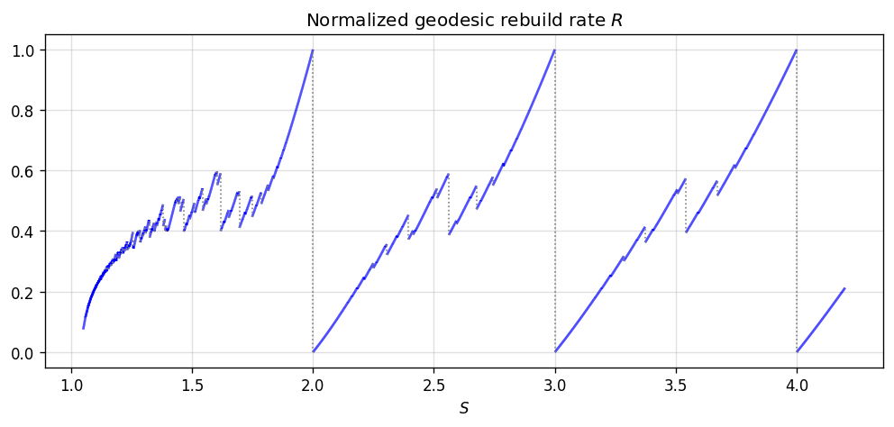
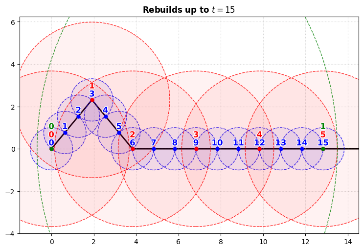

## Mathematical model for updates with one object

We want to analyze the rebuild process of the algorithm when there is only one object. We simplify the object to a point and generalize the region radii from $S^k$ to an arbitrary strictly increasing sequence. This gives an independent mathematical model based on the update procedure.

Let $(X,d)$ be a metric space and let

$$
0<r_0<r_1<r_2<\cdots
$$

be a strictly increasing sequence of radii. Define corresponding differences by

$$
\Delta_0=r_0,
\qquad
\Delta_k=r_k-r_{k-1},
\quad k\ge 1.
$$

For technical reasons (rebuild cascade termination), we also require that $(\Delta_k)$ is not bounded.

A point moves along an arc-length parametrized path

$$
\gamma:[0,\infty)\to X.
$$

For each level $k\ge0$, let $c_k=c_k(t)$ denote the center of the level-$k$ ball at time $t$. Initially, all centers coincide with the initial position of the point:

$$
c_0(0)=c_1(0)=c_2(0)=\cdots=\gamma(0).
$$

At level $k$, the associated ball is

$$
B(c_k,r_k).
$$

For $k\ge1$, the level-$k$ ball encloses the level-$(k-1)$ ball if and only if

$$
d(c_k,c_{k-1})+r_{k-1}\le r_k,
$$

or equivalently,

$$
d(c_k,c_{k-1})\le\Delta_k.
$$

Level $0$ rebuilds whenever the moving point reaches distance $r_0$ from its current center, i.e. when the point is no longer contained in the level $0$ ball. At such a rebuild, $c_0$ is reset to the current position of the point. For each $k\ge1$, level $k$ rebuilds when a level-$(k-1)$ rebuild causes the level-$k$ ball to cease enclosing the level-$(k-1)$ ball. At such a rebuild, $c_k$ is reset to the new value of $c_{k-1}$.

Rebuilds are processed from lower levels to higher levels. When a level-$(k−1)$ rebuild changes $c_{k−1}$, the new enclosure condition between levels $k−1$ and $k$ is immediately tested. If it fails, level $k$ rebuilds and $c_k$ is reset to the new $c_{k−1}$; this may in turn trigger a rebuild at level $k+1$, and so on. Because $\gamma$ is arc-length parametrized, $d(c_k, c_{k-1}) \le t$ at time $t$. Since $(\Delta_k)$ is unbounded, $\Delta_k\ge t$ for some $k=k_0$, guaranteeing that the enclosure condition holds at level $k_0$ and the cascade terminates after finitely many levels.

For every level $k\ge 0$, we regard the initial configuration at time $t=0$ as the first level-$k$ rebuild. For each level $k$, let

$$
t_{k,0}=0<t_{k,1}<t_{k,2}<\cdots
$$

denote the successive level-$k$ rebuild times whenever these times exist.

**Lemma (Rebuild displacement bound)**  
Let 

$$
a=c_k(t_{k,i}),
\qquad
b=c_k(t_{k,i+1})
$$

be two consecutive rebuild positions at level $k\ge 1$. Then

$$
\Delta_k<d(a,b)\le r_k.
$$

**Proof**  
For the lower bound, immediately after the rebuild at $a$, the level-$(k-1)$ center coincides with $a$. The level-$k$ ball continues to enclose the level-$(k-1)$ ball precisely while

$$
d(a,c_{k-1})\le\Delta_k.
$$

The rebuild at $b$ occurs at the first level-$(k-1)$ rebuild for which this condition fails. Since equality still satisfies the enclosure condition, we have

$$
d(a,b)>\Delta_k.
$$

For the upper bound, let $T=t_{k,i+1}$ be the time of the rebuild at $b$. Before time $T$, the level-$k$ ball still has center $a$, and the point remains enclosed by this ball. Hence

$$
d(\gamma(t),a)<r_k
$$

for $t<T$. At time $T$, the new level-$k$ center is the current position of the point, so $b=\gamma(T)$.

Since $\gamma$ is continuous,

$$
d(a,b)
=

\lim_{t\to T^-}d(a,\gamma(t))
\le r_k.
$$
$\square$

## Dynamics of minimizing geodesics

In this section we assume that $\gamma$ is a unit-speed minimizing geodesic. The following lemma shows that, at every level, all intervals between successive rebuilds have the same length, and gives an explicit recurrence for these lengths.

**Lemma (Dynamics of minimizing geodesics)**  
Suppose that $\gamma$ is a unit-speed minimizing geodesic. For every $k$, every interval between successive level-$k$ rebuilds has the same length $L_k$. It is uniquely determined by

$$
L_0=r_0, \quad
C_k=
\left\lfloor
\frac{\Delta_k}{L_{k-1}}
\right\rfloor+1, \quad 
L_k=C_kL_{k-1}.
$$

**Proof**  
Let $L_k$ denote the interval between the first and second level-$k$ rebuilds. We use induction to prove that every level-$k$ interval has length $L_k$.

For level $0$, the point moves at unit speed and a rebuild occurs whenever it has traveled distance $r_0$ from the current center. Hence $L_0=r_0$, and every level-$0$ rebuild interval has length $L_0$.

Now suppose $k\ge1$, and assume every level-$(k-1)$ rebuild interval has length $L_{k-1}$.

Immediately after the first level-$k$ rebuild, the centers of all levels up to $k$ coincide:
$$
c_0=c_1=\cdots=c_k.
$$

By the induction hypothesis, consecutive level-$(k-1)$ rebuilds occur $L_{k-1}$ units of time apart. Since $\gamma$ is unit-speed, the point travels exactly $L_{k-1}$ units of arc length between consecutive level-$(k-1)$ rebuilds. Because $\gamma$ is also minimizing, this arc length equals the metric distance between the corresponding positions. Thus each successive level-$(k-1)$ rebuild moves $c_{k-1}$ a distance exactly $L_{k-1}$ along $\gamma$.

Consequently, after $m$ level-$(k-1)$ rebuilds following the level-$k$ rebuild, the level-$(k-1)$ center has moved a distance
$$
d(c_{k-1},c_k)=mL_{k-1}
$$
from the fixed level-$k$ center.

The level-$k$ region continues to enclose the level-$(k-1)$ region precisely while
$$
mL_{k-1}\le \Delta_k.
$$

Therefore the largest number of level-$(k-1)$ rebuilds that can occur while the level-$k$ region remains enclosing is
$$
\left\lfloor\frac{\Delta_k}{L_{k-1}}\right\rfloor.
$$

The next level-$k$ rebuild therefore occurs after
$$
C_k=
\left\lfloor\frac{\Delta_k}{L_{k-1}}\right\rfloor+1
$$
level-$(k-1)$ rebuilds, giving
$$
L_k=C_kL_{k-1}.
$$

Finally, after every level-$k$ rebuild,

$$
c_0=c_1=\cdots=c_k.
$$

Thus the configuration of the centers is identical to the initial configuration, except translated along the minimizing geodesic. Since the dynamics depend only on the relative positions of the centers, the subsequent evolution is identical after every level-$k$ rebuild. Therefore every interval between successive level-$k$ rebuilds has length $L_k$. $\square$

**Lemma**  
Suppose that $r_k=S^k$ for every $k$. Then 

$$
C_k\in\bigl\{\left\lfloor{S}\right\rfloor,\left\lceil{S}\right\rceil\bigr\}.
$$

for every $k\ge 1$. In particular, if further $S=n>1$ is an integer, then $C_k=n$ and $L_k=n^k$ for every $k\ge 1$.

**Proof**  
Denote $x = (S^k - S^{k-1})/L_{k-1}$. The rebuild displacement bounds $S^{k-1} - S^{k-2} < L_{k-1} \le S^{k-1}$ yield 

$$
S - 1 \le x < S.
$$

Taking the floor of the lower bound gives $\lfloor S \rfloor - 1 \le \lfloor x \rfloor$. For the upper bound, $x < S \le \lceil S \rceil$ implies the strict inequality $\lfloor x \rfloor < \lceil S \rceil$, which reduces to $\lfloor x \rfloor \le \lceil S \rceil - 1$ as both sides are integers. Combining these yields

$$
\lfloor S \rfloor - 1 
\le 
\lfloor x \rfloor 
\le 
\lceil S \rceil - 1.
$$

Since $C_k = \lfloor x \rfloor + 1$, it follows that $\lfloor S \rfloor \le C_k \le \lceil S \rceil$.

The claim concerning integers $S$ immediately follows.
$\square$

The table below lists some values of $(C_k)$ and $(L_k/S^k)$ for different values of $S$. 

$$
\begin{array}{c||c|cccccccccccc}
S & k & 0 & 1 & 2 & 3 & 4 & 5 & 6 & 7 & 8 & 9 & 10 & 11 & 12 \\
\hline
3/2 & C_k &  & 1 & 1 & 2 & 1 & 2 & 1 & 2 & 2 & 1 & 2 & 1 & 2 \\
& L_k/S^k & 1 & 0.67 & 0.44 & 0.59 & 0.40 & 0.53 & 0.35 & 0.47 & 0.62 & 0.42 & 0.55 & 0.37 & 0.49 \\
\hline
2 & C_k &  & 2 & 2 & 2 & 2 & 2 & 2 & 2 & 2 & 2 & 2 & 2 & 2 \\
& L_k/S^k & 1 & 1 & 1 & 1 & 1 & 1 & 1 & 1 & 1 & 1 & 1 & 1 & 1 \\
\hline
5/2 & C_k &  & 2 & 2 & 3 & 2 & 3 & 3 & 2 & 3 & 2 & 3 & 2 & 3 \\
& L_k/S^k & 1 & 0.8 & 0.64 & 0.77 & 0.61 & 0.74 & 0.88 & 0.71 & 0.85 & 0.68 & 0.82 & 0.65 & 0.78 \\
\end{array}
\\[4pt]
\text{Sequences for $S=3/2,2,5/2$. Terms that do not have two decimal digits are exact.}
$$

### Total rebuild rate

The rebuild frequency of level $k$ is $1/L_k$, since one rebuild occurs every $L_k$ units of travel.

The total rebuild frequency of the hierarchy is therefore

$$
R=\sum_{k=0}^{\infty}\frac{1}{L_k}.
$$

Here $R$ represents the total asymptotic frequency of rebuild events across all levels, and serves as a simple mathematical proxy for the amount of tree-maintenance work in the algorithm caused by the object's motion. Each rebuild at each level counts as a separate event. Thus, if one level-0 rebuild triggers a cascade through several higher levels, every rebuild in the cascade contributes separately to R.

### Bounding total rebuild rate

The displacement bound gives, for two consecutive rebuild positions at level $k$,

$$
\Delta_k<d(a,b)\le r_k.
$$

In the minimizing geodesic case, the path is unit-speed, so the distance between consecutive level-$k$ rebuild positions is exactly the time between them. Thus

$$
\Delta_k<L_k\le r_k.
$$

This leads us to define lower and upper total rebuild rates

$$
R_{\mathrm{ideal}}
=
\sum_{k=0}^{\infty}\frac{1}{r_k},
\qquad
R_{\mathrm{upper}}
=
\sum_{k=0}^{\infty}\frac{1}{\Delta_k}
$$

and the corresponding bounds are

$$
R_{\mathrm{ideal}}\le R < R_{\mathrm{upper}}
$$

assuming $R_{\text{upper}}<\infty$. Note that then $R=R_{\text{ideal}}$ if and only if $L_k=r_k$ for every $k$.

## Rebuild rates for $r_k=S^k$

Suppose that $r_k=S^k$ for some $S>1$. Then the ideal and upper total rebuild rates involve geometric series and evaluate to

$$
\frac{S}{S-1}
=
R_{\mathrm{ideal}}
\le R<
R_{\mathrm{upper}}
=
\frac{S^2-S+1}{(S-1)^2}.
$$

We know that if $S=n$ is an integer, then $L_k=n^k$ for every $k$, so that $R=R_{\text{ideal}}$ and the lower bound is realized. Below we show that the upper bound is also realized as limits $S\to n^-$ for integer $n>1$.

**Lemma**  
Let $n>1$ be an integer. For every fixed $k\ge1$, there exists $\delta_k>0$ such that

$$
L_k=(n-1)n^{k-1}
$$

for all $S\in(n-\delta_k,n)$.

**Proof**  
We proceed by induction on $k$. For $k=1$,

$$
L_1=\lfloor S\rfloor=n-1
$$

throughout $S\in(n-1,n)$.

Suppose the claim holds at level $k-1$. Then, sufficiently close to $n$,

$$
C_k
=

\left\lfloor
\frac{S^k-S^{k-1}}{(n-1)n^{k-2}}
\right\rfloor+1.
$$

The expression inside the floor is strictly increasing in $S$ and equals $n$ at $S=n$. It is therefore less than $n$ for $S<n$ and greater than $n-1$ for $S$ sufficiently close to $n$. Hence $C_k=n$ sufficiently close to $n$, and

$$
L_k=nL_{k-1}=(n-1)n^{k-1}.
$$

This completes the induction. $\square$

**Proposition**  
For every integer $n>1$,

$$
\lim_{S\to n^-}R(S)
=
R_{\text{upper}}(n).
$$

**Proof**  
By the lemma, for every fixed $k$,

$$
\lim_{S\to n^-}\frac{1}{L_k(S)}
=

\frac{1}{(n-1)n^{k-1}}.
$$

Furthermore, for $S$ sufficiently close to $n$,

$$
\frac{1}{L_k(S)}
<
\frac{1}{S^{k-1}(S-1)},
$$

and the right-hand side is uniformly bounded near $n$ by a summable geometric sequence. Thus the limit may be taken termwise in the rebuild-rate series, giving

$$
\lim_{S\to n^-}R(S)
=
1+\sum_{k=1}^{\infty}\frac{1}{(n-1)n^{k-1}}
=
\frac{n^2-n+1}{(n-1)^2}
=
R_{\text{upper}}(n).
$$
$\square$

In the graph below we plot $R$ as function of $S$, normalized so that $y=0$ corresponds to $R_\text{ideal}$ and $y=1$ corresponds to $R_\text{upper}$. Specifically, the plot shows

$$
\frac{R(S)-R_\text{ideal}(S)}{R_\text{upper}(S)-R_\text{ideal}(S)}.
$$

It demonstrates the jumps from $R\approx R_{\text{upper}}$ just before an integer to $R=R_{\text{ideal}}$ at the integer value. 

<figure>

</figure>

## Non-geodesic paths

Suppose that $\gamma$ is an arc-length parametrized path, but not necessarily a minimizing geodesic. We can no longer write explicit formulas for the rebuild times or obtain a periodic rebuild schedule. However, the rebuild displacement bound remains valid: if $a$ and $b$ are two consecutive rebuild positions at level $k$, then

$$
\Delta_k<d(a,b)\le r_k.
$$

Since the distance between two points is at most the length of the path segment connecting them, consecutive level-$k$ rebuilds must be separated by more than $\Delta_k$ units of travel.

For each level $k$, let

$$
m_k(t)=\#\{i:0 < t_{k,i}\le t\}
$$

denote the number of level-$k$ rebuilds up to time $t>0$, excluding the initial rebuild. Define the total number of rebuild events across all levels up time $T$ as

$$
M(t) = \sum_{k=0}^\infty m_k(t).
$$

Then we define upper asymptotic rebuild rate by

$$
R^+
=
R^+(\gamma)
=
\limsup_{t\to\infty}\frac{M(t)}{t}.
$$

**Proposition**  
The upper asymptotic rebuild rate satisfies

$$
R^+
\le
R_{\text{upper}}.
$$

In particular, if $S>1$ and $(r_k)=(S^k)$, then

$$
R^+
\le
\frac{S^2-S+1}{(S-1)^2}.
$$

**Proof**  
There are $m_k(t)$ non-initial level-$k$ rebuilds by time $t>0$. Each is separated from its preceding level-$k$ rebuild by more than $\Delta_k$ units of travel. Thus

$$
t > m_k(t)\Delta_k
$$

for every $k\ge 0$ and every $t>0$. From this obtain

$$
R^+
=
\limsup_{t\to\infty}\lim_{j\to\infty}\sum_{k=0}^j\frac{m_k(t)}{t}
\le
\limsup_{t\to\infty}\lim_{j\to\infty}\sum_{k=0}^j\frac{1}{\Delta_k}
=
\sum_{k=0}^\infty\frac{1}{\Delta_k}
=
R_{\text{upper}}.
$$

$\square$

If $S=n>1$ is an integer, and $r_k=S^k$, then it can be shown that a minimizing geodesic maximizes the upper asymptotic rebuild rate.

A minimizing geodesic is a natural candidate for maximizing the upper asymptotic rebuild rate because it does this if $S$ is integer, and regardless of $S$ it follows a greedy strategy: after each rebuild, it moves directly toward the nearest point at which the next rebuild can occur. This makes each individual rebuild occur as early as possible, but, as the construction below shows, this local strategy need not maximize the upper asymptotic rebuild rate. 

### Example: minimizing geodesics do not always maximize upper asymptotic rebuild rate

We construct a path in $\R^2$ that mostly follows a geodesic but with an initial (and periodically repeated) perturbation that changes the phase of the rebuild schedule so that, through level $4$, the path $\gamma$ has exactly the same rebuild-rate contribution as the geodesic,

$$
1+\frac13+\frac{11}{135}+\frac{3}{135}+\frac{1}{135}
=
1+\frac13+\frac1{12}+\frac1{48}+\frac1{144}.
$$

However, the level-$4$ rebuild of $\gamma$ is reached after a net advance of only

$$
\Delta_2+123\approx 132.83,
$$

whereas the corresponding geodesic advance is $144$. Thus $\gamma$ reaches the same level $0$ to $4$ rebuild rate using a smaller advance. This difference propagates to the higher levels and eventually gives $\gamma$ a strictly larger upper asymptotic rebuild rate.

##### Construction

Fix $S=147/40=3.675$ and let $(r_k)=(S^k)$. We construct a path $\gamma:[0,\infty)\to\R^2$ satisfying

$$
R^+(\gamma)>R(S).
$$

Let $\theta\in(0,\pi/2)$ be the unique angle satisfying

$$
6\cos\theta=\Delta_2-6\approx 3.83.
$$

Denote

$$
A=\Delta_2+123\approx 132.83.
$$

Let $\gamma_4 : [0, 135] \to \mathbb{R}^2$ be the unit-speed, piecewise linear path connecting these vertices in sequence:

$$
\begin{aligned}
(0,0) 
&\to (3\cos\theta, 3\sin\theta) \\
&\to (6\cos\theta, 0) = (\Delta_2 - 6, 0) \\
&\to (A, 0).
\end{aligned}
$$

Define $\gamma:[0,\infty)\to\R^2$ by 

$$
\gamma(t)
=
\gamma_4\bigl(t - 135\lfloor t/135 \rfloor\bigr) 
+ \lfloor t/135 \rfloor \bigl(\gamma_4(135) - \gamma_4(0)\bigr).
$$

That is, $\gamma$ repeats $\gamma_4$ indefinitely, translating each copy by 

$$
\gamma_4(135)-\gamma_4(0)
=
(A,0)
$$

so that the resulting path is continuous. Since each copy is unit-speed and the translations do not affect speed, $\gamma$ is also unit speed. 

##### Rebuilds up to level $4$

Let's begin by examining the rebuild events of $\gamma$ on the interval $(0,135]$. We exclude $0$ so that initial builds are not counted but include the endpoint $135$ so that any rebuild exactly at $135$ is included.

Level-$0$ rebuilds happen exactly at each $t\in\{1,2,3,\ldots,135\}$.

Level-$1$ rebuilds happen exactly at each $t\in\{3,6,9,\ldots,135\}$.

For level-$2$ the rebuild threshold is $\Delta_2\approx 9.83$. At the fourth level-$1$ rebuild at $t=12$ we have $\gamma(12)=(\Delta_2,0)$ so that we are exactly on the threshold and this does not cause a level-$2$ rebuild. Therefore the fifth level-$1$ rebuild at $\gamma(15)=(\Delta_2+3,0)$ causes the first level-$2$ rebuild. See image below but note that it includes initial builds at $t=0$.

After $t=15$ the path follows a straight line and the subsequent level-$2$ rebuilds happen with intervals of $L_2=12$. This means that the level-$2$ rebuilds happen exactly at $t=15+12m$, $m\in\{0,1,\ldots,10\}$.

For level-$3$ the rebuild threshold is $\Delta_3\approx 36.13$. At the third level-$2$ rebuild at $t=39$ we have $\gamma(39)=(\Delta_2+27,0)\approx(36.83,0)$. This is just over the threshold so that the first level-$3$ rebuild happens at $t=39$.

After $t=39$ the path follows a straight line and the subsequent level-$3$ rebuilds happen with intervals $L_3=48$. This means that the level-$3$ rebuilds happen exactly at $t\in\{39,87,135\}$.

For level-$4$ the rebuild threshold is $\Delta_4\approx 132.77$. At the third level-$3$ rebuild at $t=135$ we have $\gamma(135)=(A,0)\approx(132.83,0)$. This is just over the threshold so that the first level-$4$ rebuild happens at $t=135$.

These are all the rebuild events that happen for $\gamma$ on the interval $(0,135]$. There are a total of $195$ rebuild events on the interval as the following table shows.

$$
\begin{array}{c|c}
\text{Level} & \text{Count} \\
\hline
0 & 135 \\
1 & 45 \\
2 & 11 \\
3 & 3 \\
4 & 1 \\
\end{array}
$$

#####  Higher-level rebuilds

Let's look at higher level rebuilds for $\gamma$. This is simple since the path just advances by $(A,0)$ between each level-$4$ rebuild.

For level-$5$ we have $\Delta_5\approx 487.93$. The number of level-$4$ rebuild intervals between two subsequent level-$5$ rebuilds is

$$
\Bigl\lfloor\frac{\Delta_5}{A}\Bigr\rfloor+1=4
$$

and the advance in the $e_1$ direction between level-$5$ rebuilds is $4A$. 

Similarly, for level-$6$ we have $\Delta_6\approx 1793.12$. The number of level-$5$ rebuild intervals between two subsequent level-$6$ rebuilds is 

$$
\Bigl\lfloor\frac{\Delta_6}{4A}\Bigr\rfloor+1=4
$$

and the advance in the $e_1$ direction between level-$6$ rebuilds is $16A$.

Finally, for level-$7$ we have $\Delta_7\approx 6589.73$. The number of level-$6$ rebuild intervals between two subsequent level-$7$ rebuilds is 

$$
\Bigl\lfloor\frac{\Delta_7}{16A}\Bigr\rfloor+1=4.
$$

Thus there are $4\cdot 4\cdot 4=64$ level-$4$ rebuilds between two subsequent level-$7$ rebuilds. The table below counts all the rebuilds on the interval $(0,64\cdot 135]$.

$$
\begin{array}{c|c}
\text{Level} & \text{Count} \\
\hline
0 & 64\cdot 135 \\
1 & 64\cdot 45 \\
2 & 64\cdot 11 \\
3 & 64\cdot 3 \\
4 & 64 \\
5 & 16 \\
6 & 4 \\
7 & 1 \\
\hline
\text{Sum} & 12501
\end{array}
$$

Since the path is translated by the same vector after each interval of length $135$, and a level-$7$ rebuild occurs every $64$ such intervals, the entire rebuild pattern through level $7$ repeats, up to translation, on every subsequent interval of length $64\cdot 135$. Therefore 

$$
R^+(\gamma)\ge\frac{12501}{64\cdot 135}=\frac{100008}{69120}.
$$

##### Comparison with the geodesic

What about the geodesic rebuild rate? The geodesic construction gives the following values for $C_k$ and $L_k$ for $k\le 6$.

$$
\begin{array}{c||c|c|c|c|c|c|c}
k & 0 & 1 & 2 & 3 & 4 & 5 & 6 \\
\hline
C_k & & 3 & 4 & 4 & 3 & 4 & 4  \\
L_k & 1 & 3 & 12 & 48 & 144 & 576 & 2304 \\
\end{array}
$$

For the remaining terms we can use $C_k\ge\lfloor S\rfloor=3$ to get $L_k\ge 3^{k-6}L_6$ for every $k\ge 6$, and thus

$$
\begin{aligned}
R(S)
&=
\sum_{k=0}^\infty \frac{1}{L_k}
=\frac{833}{576}+\sum_{k=6}^\infty \frac{1}{L_k} \\
&\le
\frac{833}{576} + \sum_{k=6}^\infty \frac{1}{3^{k-6}L_6}
=
\frac{833}{576} + \frac{1}{L_6}\sum_{k=0}^\infty \frac{1}{3^k} \\
&=
\frac{833}{576} + \frac{3}{2L_6} 
=
\frac{6667}{4608}=\frac{100005}{69120}.
\end{aligned}
$$

Combining the bounds we get

$$
R^+(\gamma)\ge \frac{100008}{69120} > \frac{100005}{69120}\ge R(S).
$$

The preceding estimates only use enough terms to prove the strict inequality. The actual gap is larger and the full rates are approximately

$$
R^+(\gamma)\approx 1.446927,\qquad R(S)\approx 1.446808.
$$