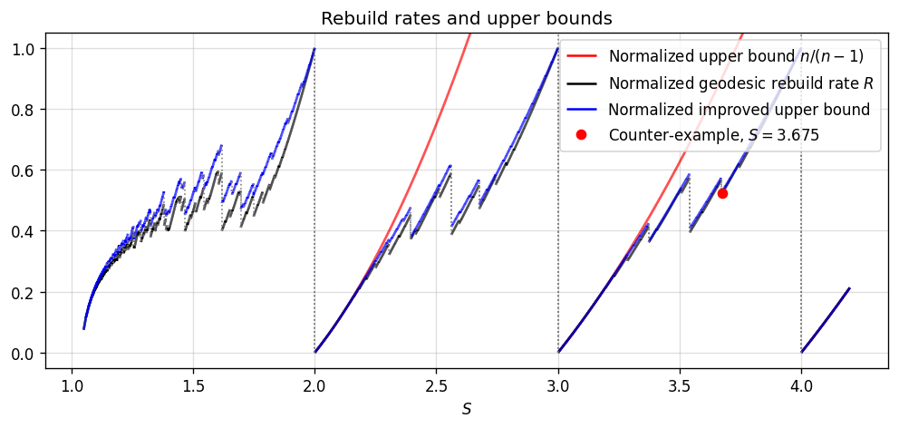

## Hierarchical tree problem

Fix $S>1$ and denote

$$
\Delta_k=(S-1)S^{k-1}.
$$

We always denote $n=\lfloor S\rfloor$. 

A **hierarchical tree of height $K\ge 1$** is a rooted tree in which every node is assigned a level $k\in\{0,\ldots,K\}$, the root has level $K$, every level-$k$ node with $k\ge1$ has at least one child, and all its children have level $k-1$. The level-0 nodes are the leaves. 

Every hierarchical tree has a uniquely determined **advance** function $a$, defined recursively from the leaves upward. For every level-0 node $I$, $a(I)=1$. For every level-$k$ node $I$, $k\ge1$, with children $I_1,\ldots,I_m$, define

$$
a(I)
=
\min\left\{
\sum_{j=1}^m a(I_j),\,S^k
\right\}.
$$

A hierarchical tree $T$ is called **admissible** if

$$
a(I)>\Delta_k
$$

for every level-$k$ node $I$ with $k\ge1$. 

A node $I$ in a hierarchical tree is called admissible if the subtree rooted at $I$ is admissible.

For a node $I$ denote

$$
\begin{aligned}
N(I)&=\#\{\text{nodes in the subtree rooted at } I\}, \\
C(I)&=\#\{\text{children of node } I\}, \\
L(I)&=\#\{\text{leaves in the subtree rooted at } I\}. \\
\end{aligned}
$$

Its **rate** is defined as

$$
R(I)=\frac{N(I)}{L(I)}.
$$

Each of these is defined for a tree by applying it to the root node.

If $T$ and $T'$ are admissible trees, we say that $T'$ **dominates** $T$ if $R(T')\ge R(T)$. Strict domination is defined by the corresponding strict inequality.

Equivalently, setting $\Delta N = N(T') - N(T)$ and $\Delta L = L(T') - L(T)$, $T'$ dominates $T$ if and only if

$$
\Delta N - R(T)\Delta L \ge 0.
$$

We say that a tree $T^*$ is **globally dominating** if it is admissible and it dominates every other admissible tree of the same height.

### Geodesic trees

Define two sequences $(L_k)_{k\ge0}$ and $(C_k)_{k>0}$ in the following way. Start with $L_0=1$. Once $L_{k-1}$ is defined, define $L_k=C_kL_{k-1}$, where $C_k$ is the smallest integer such that

$$
C_kL_{k-1} > \Delta_k.
$$

Now define the **geodesic tree** $G_K(S)$ as the unique hierarchical tree of height $K$ with $C(I)=C_k$ for every level-$k$ node $I$ with $1\le k\le K$.

**Lemma (geodesic trees are admissible)**  
Every level-$k$ node in $G_K(S)$ satisfies $a(I) = L_k$. Consequently, $G_K(S)$ is admissible.

**Proof sketch**  
Prove by induction on $k$ that $a(I)=L_k\le S^k$. 
$\blacksquare$

The connection between rebuild intervals of an arc length parametrized path and admissible trees is the following.

**Proposition**  
Let $S > 1$ and $(r_k) = (S^k)$. For any arc-length parametrized path $\gamma: [0, \infty) \to X$ in a metric space $(X, d)$, the upper asymptotic rebuild rate satisfies

$$
R^+(\gamma) \le \sup_{K \ge 1, \, T \in \mathcal{T}_K} R(T),
$$

where $\mathcal{T}_K$ denotes the set of all admissible hierarchical trees of height $K$.

**Proof**  
#### Rebuild intervals form hierarchical trees

For each level $k \ge 0$, a level-$k$ rebuild interval is a time interval $I = (t_1, t_2]$ bounded by two consecutive level-$k$ rebuild times $t_1 < t_2$. For $k \ge 1$, the interval $(t_1, t_2]$ is partitioned by the intermediate level-$(k-1)$ rebuilds occurring at times $t_1 = \tau_0 < \tau_1 < \cdots < \tau_m = t_2$. The resulting level-$(k-1)$ intervals $J_p = (\tau_{p-1}, \tau_p]$ for $p = 1, \dots, m$ are defined as the children of $I$.

Recursively terminating this parent-child relation at level-$0$ intervals associates with any individual level-$k$ rebuild interval $I$ a finite hierarchical tree $T(I)$ rooted at $I$, of height $k$, whose leaves are level-$0$ intervals.

#### Admissibility

For any rebuild interval $J = (t_1, t_2]$ at level $k \ge 0$, define its realized advance as the metric distance between its endpoints,

$$
a'(J) = d(\gamma(t_1), \gamma(t_2)).
$$

We prove by induction on $k$ that $a'(J) \le a(J)$ and that $J$ satisfies the admissibility condition $a(J) > \Delta_k$.

For the base case $k = 0$, a level-$0$ rebuild triggers when $d(\gamma(t_1), \gamma(t_2)) = r_0 = 1$, so $a'(J) = 1 = a(J)$.

For the inductive step $k \ge 1$, suppose $J = (t_1, t_2]$ has child intervals $J_p = (\tau_{p-1}, \tau_p]$ for $p = 1, \dots, m$ at level $k-1$, where $\tau_0 = t_1$ and $\tau_m = t_2$. By the triangle inequality in $(X, d)$,

$$
a'(J) = d(\gamma(t_1), \gamma(t_2)) \le \sum_{p=1}^m d(\gamma(\tau_{p-1}), \gamma(\tau_p)) = \sum_{p=1}^m a'(J_p).
$$

Furthermore, before time $t_2$, the moving point remains within the level-$k$ ball centered at $\gamma(t_1)$, so $d(\gamma(t_1), \gamma(t)) < r_k = S^k$ for $t\in(t_1,t_2)$. Taking the limit $t \to t_2^-$ gives $a'(J) = d(\gamma(t_1), \gamma(t_2)) \le S^k$. Combining these bounds with the inductive hypothesis $a'(J_p) \le a(J_p)$ yields

$$
a'(J) \le \min\left\{\sum_{p=1}^m a'(J_p), \, S^k\right\} \le \min\left\{\sum_{p=1}^m a(J_p), \, S^k\right\} = a(J).
$$

Finally, the level-$k$ rebuild triggers at $t_2$ precisely because the level-$k$ ball centered at $\gamma(t_1)$ fails to enclose the updated level-$(k-1)$ ball at $\gamma(t_2)$, which requires $d(\gamma(t_1), \gamma(t_2)) > \Delta_k$. Consequently, $a(J) \ge a'(J) > \Delta_k$, establishing that for any level-$k$ rebuild interval $I$, the associated finite tree $T(I)$ is admissible.

#### Counting the rebuild events

Fix $t > 0$ and let $\mathcal{I}(t)$ be the set of all rebuild intervals $I = (t_1, t_2]$ at any level $k \ge 0$ fully contained in $(0, t]$, meaning $0 \le t_1 < t_2 \le t$. An interval in $\mathcal{I}(t)$ is maximal if its parent interval is not contained in $(0, t]$, or if it has no parent. Let $I_1, \dots, I_m$ be all maximal intervals in $\mathcal{I}(t)$, and let $T_1, \dots, T_m$ be the finite subtrees rooted at these intervals.

Every interval $J \in \mathcal{I}(t)$ belongs to a unique maximal tree $T_i$, obtained by following its chain of parents upward within $\mathcal{I}(t)$ until reaching a maximal interval. Thus, the node sets of $T_1, \dots, T_m$ form a partition of $\mathcal{I}(t)$. Moreover, because all initial centers coincide at $t = 0$, every non-initial level-$k$ rebuild time $t_{k, i} \in (0, t]$ has its preceding rebuild time $t_{k, i-1} \ge 0$. Hence, every non-initial rebuild event in $(0, t]$ is the right endpoint of a unique interval in $\mathcal{I}(t)$, and each node in a subtree $T_i$ corresponds to exactly one such event. Summing across the partition yields the exact event count

$$
M(t) = \sum_{k=0}^\infty m_k(t) = \sum_{i=1}^m N(T_i).
$$

#### Leaf count bound and asymptotic limit

The leaves of $T_1, \dots, T_m$ are level-$0$ intervals in $\mathcal{I}(t)$. Because $\gamma$ is arc-length parametrized, each leaf interval $J$ has length $|J|\ge 1$. Since all leaf intervals across all maximal trees are mutually disjoint sub-intervals of $(0, t]$, their total length satisfies

$$
t \ge \sum_{i=1}^m \sum_{J \in \text{Leaves}(T_i)}|J| \ge \sum_{i=1}^m L(T_i).
$$

Combining the event count and the time bound for any $t$ after the first level-$0$ rebuild gives

$$
\frac{M(t)}{t} \le \frac{\sum_{i=1}^m N(T_i)}{\sum_{i=1}^m L(T_i)} \le \max_{1 \le i \le m} \frac{N(T_i)}{L(T_i)} \le \sup_{K \ge 1, \, T \in \mathcal{T}_K} R(T),
$$

Taking the upper limit as $t \to \infty$ completes the proof. $\blacksquare$

This motivates us to study upper bounds for the rate of admissible trees. One immediate question is: Are geodesic trees $G_K(S)$ always globally dominating?

We will later show that geodesic trees are globally dominating for all integer $S$, and also for all $K\le 3$.

However, the answer turns out to be generally no, as shown by an example given later. 

### Basic properties

**Lemma (node replacement)**
Let $T$ be an admissible tree with a level-$k$ node $I$, and let $I'$ be another admissible level-$k$ node with $a(I') \ge a(I)$. Then the tree $T'$ obtained by replacing the subtree rooted at $I$ with the subtree rooted at $I'$ is admissible.

**Proof sketch**  
The recursive definition $a(J) = \min\left\{\sum a(J_j), S^m\right\}$ is composed of addition and the minimum operator, both of which are non-decreasing in every argument. Increasing the advance of a child node from $a(I)$ to $a(I')$ can therefore only increase or preserve the advance values of its ancestors, ensuring $a'(J) \ge a(J) > \Delta_m$ for all nodes $J$ outside the replaced subtree. $\blacksquare$

Reminder that we always write $n=\lfloor S\rfloor$.

**Lemma**  
For every node $I$ at level $k$ in a hierarchical tree:

i) $a(I)\le L(I)$ for every $k\ge 0$.  
ii) If $I$ is admissible, then $C(I) \ge n$ for $k \ge 1$.  
iii) If $I$ is admissible, then $a(I)\ge n^k$ for every $k\ge 0$.  

**Proof sketch**  
Each claim can be proved by induction on $k$. $\blacksquare$

**Proof**  
We prove each claim by induction on $k$.

**i)** For $k=0$, $a(I) = 1$. For $k \ge 1$, assume the claim holds for each level $k-1$ node. Then

$$
a(I)=
\min\left\{ \sum_{j=1}^p a(I_j),\, S^k \right\}
\le
\sum_{j=1}^p L(I_j)
=L(I).
$$

**ii)** Let $I$ be an admissible level-$k$ node ($k \ge 1$) with $p = C(I)$ children $I_1, \dots, I_p$. Since $I$ is admissible, each child $I_j$ is an admissible level-$(k-1)$ node. Admissibility of $I$ requires $a(I) > \Delta_k = (S-1)S^{k-1}$. Since $a(I) \le \sum_{j=1}^p a(I_j) \le p S^{k-1}$, we must have:

$$
p S^{k-1} > (S-1)S^{k-1}.
$$

Hence $p>S-1$. The strict inequality on the integer $p$ forces $p \ge n$.

**iii)** We proceed by induction on $k$. The base case for $k=0$ is true since $a(I)=1$ for leaves. 
Assume that $a(I_j) \ge n^{k-1}$ for each child $j$. Then

$$
a(I) = \min\left\{ \sum_{j=1}^p a(I_j),\, S^k \right\}.
$$

The first term satisfies $\sum_{j=1}^p a(I_j) \ge C(I)\, n^{k-1} \ge n^k$.
The second term satisfies $S^k\ge n^k$ since $S\ge n$.
Since both terms are at least $n^k$, we obtain $a(I) \ge n^k$. $\blacksquare$

When $S = n \in \mathbb{Z}_{\ge 2}$, the geodesic sequence yields $C_k = n$ for all $k \ge 1$, so $G_K(n)$ is the regular $n$-ary tree of height $K$.

**Lemma**  
For every $k\ge 1$, 

$$
C_k\in\{n,n+1\}.
$$

**Proof**  
We already know that $C_k \ge n$ since any admissible level-$k$ node has at least $n$ children. 

For the upper bound when $k=1$, we have $(n+1)L_0 = n+1 > S-1 = \Delta_1$. Since $C_1$ is the smallest integer with $C_1 L_0 > \Delta_1$, we get $C_1 = n$.

For $k \ge 2$, the node $G_{k-1}$ is admissible, so $L_{k-1} > \Delta_{k-1}$. Combining this with $n+1 > S$ yields

$$
(n+1)L_{k-1} > S\Delta_{k-1} = S(S-1)S^{k-2} = \Delta_k.
$$

By minimality of $C_k$, we conclude $C_k \le n+1$. $\blacksquare$

**Proposition (conjecture is true for integer $S$)**  
If $S = n \in \Z_{\ge 2}$, then $G_K(n)$ is globally dominating.

**Proof**  
Let $T$ be an admissible tree of height $K$. We will prove by induction on level $k \in \{0, \dots, K\}$ that every admissible level-$k$ node $I$ in $T$ satisfies

$$
R(I) \le R\bigl(G_k(n)\bigr).
$$

If $k=0$, then $I$ is a leaf, so $R(I) = 1 = R(G_0(n))$.

Assume the claims hold for all admissible level-$(k-1)$ nodes. Let $I$ be an admissible level-$k$ node with children $I_1, \dots, I_p$. By the previous lemma, admissibility implies $p = C(I) \ge n$. Furthermore, each $I_j$ is an admissible level-$(k-1)$ node, so by the induction hypothesis:

$$
\quad R(I_j) \le R\bigl(G_{k-1}(n)\bigr) \quad \text{for all } j \in \{1, \dots, p\}.
$$

We get

$$
\begin{aligned}
N(I) &= 1 + \sum_{j=1}^p N(I_j) = 1 + \sum_{j=1}^p R(I_j) L(I_j) \\
&\le 1 + R\bigl(G_{k-1}(n)\bigr) \sum_{j=1}^p L(I_j) = 1 + R\bigl(G_{k-1}(n)\bigr) L(I).
\end{aligned}
$$

Dividing both sides by $L(I) > 0$ yields

$$
R(I) = \frac{N(I)}{L(I)} \le \frac{1}{L(I)} + R\bigl(G_{k-1}(n)\bigr).
$$

By the basic properties lemma, an admissible level-$k$ node satisfies $L(I) \ge a(I) \ge n^k$, which yields

$$
R(I) \le n^{-k} + R\bigl(G_{k-1}(n)\bigr).
$$

For the regular $n$-ary tree $G_k(n)$, each internal node has $n$ identical children. It follows that $L(G_k(n))=n^k$ and each child of the root is $G_{k-1}(n)$. Expanding at the root node we get

$$
R(G_k(n)) = 
\frac{N(G_k(n))}{L(G_k(n))}
=
\frac{1 + n N(G_{k-1}(n))}{nL(G_{k-1}(n))} = n^{-k} + R(G_{k-1}(n)).
$$

Combining this with our previous inequality we get $R(I) \le R(G_k(n))$.

By induction, the root of $T$ satisfies $R(T) \le R(G_K(n))$. $\blacksquare$

For this reason we assume for the rest of the discussion that $S$ is not an integer, i.e. $n<S<n+1$.

### Existence of globally dominating trees

**Lemma (admissibility threshold)**  
If a hierarchical tree node $I$ has at least $n+1$ admissible children, then $I$ is admissible.

**Proof**  
Denote the children by $I_1,\ldots,I_m$, $m\ge n+1$. Since $n+1 > S$, we have 

$$
\sum_{j=1}^m a(I_j) > (n+1)\Delta_{k-1} = (n+1)(S-1)S^{k-2} > \Delta_k.
$$

Thus $I$ is admissible. $\blacksquare$

**Lemma (node splitting)**  
Let $T$ be an admissible tree of height $K$. If an internal node $I$ at level $k < K$ has $C(I) \ge 2n + 2$ children, there exists an admissible tree $T'$ of height $K$ that strictly dominates $T$, obtained by replacing $I$ under its parent $P$ with two level-$k$ nodes $I_1$ and $I_2$.

**Proof**  
Partition the children of $I$ under two new level-$k$ nodes $I_1$ and $I_2$, each receiving at least $n+1$ children. By the admissibility threshold lemma, $I_1$ and $I_2$ are admissible.

Let $A_1$ and $A_2$ be the sums of advances of the children assigned to $I_1$ and $I_2$, respectively. Before replacement, $I$ supplied advance $a(I) = \min\{S^k, A_1+A_2\}$. After replacement, the pair supplies

$$
a(I_1) + a(I_2) = \min\{S^k, A_1\} + \min\{S^k, A_2\} \ge \min\{S^k, A_1+A_2\} = a(I).
$$

Replacing $I$ with $I_1$ and $I_2$ under $P$ creates a modified parent node $P'$ whose advance satisfies $a(P') \ge a(P)$. Applying node replacement to $P$ guarantees that the resulting tree $T'$ is admissible. Finally, $L(T') = L(T)$ and $N(T') = N(T) + 1$, so $R(T') > R(T)$. $\blacksquare$

**Lemma (uniformly bounded branching)**  
For every admissible tree $T$ of height $K$, there exists an admissible tree $T'$ of height $K$ that dominates $T$ and satisfies $C(I) \le 2n + 1$ for all internal nodes $I$.

**Proof**  
Apply the node splitting lemma bottom-up for levels $k=1$ to $K-1$. Each split strictly increases $N$ while keeping $L$ constant, producing a dominating admissible tree $T_1$ with $C(I) \le 2n+1$ for all non-root internal nodes.

Next we handle the root. If $C(T_1) \ge n + 2$, the rate $R(T_1)$ satisfies

$$
R(T_1) = \frac{1}{L(T_1)} + \sum_{J\prec T_1} \frac{L(J)}{L(T_1)} R(J).
$$

Because $R(T_1)$ strictly exceeds the weighted average of its children's rates, there exists a child $J$ with $R(J) < R(T_1)$. Removing $J$ produces a tree $T_2$ whose root retains at least $n+1$ children (hence remaining admissible) and has rate

$$
R(T_2) = \frac{N(T_1)-N(J)}{L(T_1)-L(J)} > R(T_1).
$$

Repeating this removal process until the root has at most $n+1$ children yields a tree $T'$ with $C(I) \le 2n+1$ at all levels that dominates $T$. $\blacksquare$

**Theorem (globally dominating trees exist)**  
For every $K \ge 1$, there exists a globally dominating admissible tree of height $K$.

**Proof**  
By previous lemma, every admissible tree is dominated by one in which every node has at most $2n+1$ children. Since height and branching are uniformly bounded, the set of such tree topologies is finite. Thus, the set of achievable rates $R(T)$ among these bounded trees is non-empty and finite, so it contains a maximum $R(T^*)$. Now $T^*$ dominates every admissible tree of height $K$. $\blacksquare$

#### Geodesic lift

Let $I$ be an admissible node of level $k$. We define the **geodesic lift** of $I$ to be the tree obtained by starting with $I$ and repeatedly copying the current tree the smallest number of times needed to form an admissible node at the next level.

More precisely, set $I^{(0)}=I$. Given $I^{(j-1)}$, let

$$
m_j = \left\lfloor \frac{\Delta_{k+j}}{a(I^{(j-1)})} \right\rfloor + 1.
$$

Thus $m_j$ is the smallest positive integer such that $m_j a(I^{(j-1)}) > \Delta_{k+j}$. Making $m_j$ copies of $I^{(j-1)}$ the children of a new node $I^{(j)}$ yields total advance $m_j a(I^{(j-1)}) \le \Delta_{k+j} + a(I^{(j-1)}) \le S^{k+j}$. Hence the advance cap at level $k+j$ is inactive, so $a(I^{(j)}) = m_j a(I^{(j-1)})$.

We may continue up to level $K$, producing the geodesic lift $I^{\langle K\rangle}$ of $I$ to height $K$. The node and leaf counts satisfy $N(I^{(j)}) = 1 + m_j N(I^{(j-1)})$ and $L(I^{(j)}) = m_j L(I^{(j-1)})$, which yields

$$
R(I^{(j)}) = R(I^{(j-1)}) + \frac{1}{m_j L(I^{(j-1)})}.
$$

Unrolling this recurrence gives

$$
R(I^{\langle K\rangle}) = R(I) + \frac{1}{L(I)} \sum_{j=1}^{K-k} \frac{1}{m_1 \cdots m_j}.
$$

In particular, the geodesic lift strictly increases rate: $R(I^{\langle K\rangle}) > R(I)$.

The geodesic tree $G_K(S)$ is the geodesic lift of a leaf. More generally, the geodesic lift of any of its nodes is the tree itself.

**Lemma**  
Suppose $T$ is a globally dominating tree of height $K$, and let $I$ be one of its non-root nodes. Then $R(I) < R(T)$. In particular, the tree $T'$ obtained by removing $I$ from $T$ cannot be admissible.

**Proof**  
The geodesic lift $I^{\langle K\rangle}$ is an admissible tree of height $K$. Since $T$ is globally dominating, $R(I^{\langle K\rangle}) \le R(T)$, which gives $R(I) < R(I^{\langle K\rangle}) \le R(T)$.

If $T'$ is formed by removing the subtree rooted at $I$ from $T$, its rate satisfies

$$
R(T') = \frac{N(T) - N(I)}{L(T) - L(I)} > \frac{N(T) - R(T)L(I)}{L(T) - L(I)} = R(T).
$$

If $T'$ were admissible, $R(T') > R(T)$ would contradict the global dominance of $T$. $\blacksquare$

### Investigating low level nodes

**Proposition (upper bound for $R$)**  
Suppose that every level-$k$ admissible node $I$ satisfies

$$
R(I)\le r_k.
$$

Then every admissible tree $T$ of height $K>k$ satisfies

$$
R(T)
\le 
r_k+
\sum_{j=k+1}^K \frac1{u_j},
$$

where

$$
u_j = \max\bigl\{\lfloor\Delta_j\rfloor+1, n^j\bigr\}.
$$

In particular, 

$$
\begin{aligned}
R(T)
&\le r_k + 
\frac{S(S^{-k}-S^{-K})}{(S-1)^2}\qquad\text{and} \\
R(T)
&\le r_k + 
\frac{n^{-k}-n^{-K}}{n-1},\qquad (n>1).
\end{aligned}
$$

**Proof**  
Let $M_j$ denote the number of level-$j$ nodes in $T$, and let $M_{>k} = \sum_{j=k+1}^K M_j$ be the number of nodes strictly above level $k$. Since the level-$k$ subtrees partition all nodes at or below level $k$, we can split the total node count as $N(T) = M_{>k} + \sum_{\operatorname{level}(I)=k} N(I)$. Dividing by $L(T)$ yields

$$
R(T) = \frac{M_{>k}}{L(T)} + \sum_{\operatorname{level}(I)=k} \frac{L(I)}{L(T)} R(I).
$$

Applying the bound $R(I) \le r_k$ to each level-$k$ subtree gives $R(T) \le r_k + \frac{M_{>k}}{L(T)}$.

For every level-$j$ node $I$ with $j > k$, admissibility requires $a(I)>\Delta_j$. Since $L(I) \ge a(I)$ and $L(I)$ is an integer, we have $L(I) \ge \lfloor \Delta_j \rfloor + 1$. Disjointness of the level-$j$ subtrees then implies

$$
M_j \le \frac{L(T)}{\lfloor\Delta_j \rfloor + 1}.
$$

Alternatively, since every internal node has at least $n$ children, $M_{j-1} \ge n M_j$. With $M_0 = L(T)$, this gives $M_j \le n^{-j} L(T)$.

Together the bounds give $M_j \le L(T)/u_j$, so $M_{>k}/L(T)\le \sum_{j=k+1}^K 1/u_j$.

Finally, using the bounds $u_j > \Delta_j$ and $u_j\ge n^{j}$, summing over $j = k+1, \ldots, K$ as finite geometric series yields the explicit bounds. $\blacksquare$

The previous proposition is interesting since it can benefit from information from small $k$. Once a bound is known for level $k$, then we get a new bound for every tree higher than $k$. One immediate consequence of the proposition is that 

$$
R(T)<\frac{n}{n-1}
$$

whenever $n>1$ as we can see by applying it with $r_0=1$.

#### Level-$1$

We say that a level-$k$ node $I$ is saturated if $a(I)=S^k$. 

**Theorem (level-$1$ solve)**  
Let $I$ be a level-$1$ node in a globally dominating tree. Then

$$
C(I)=n.
$$

**Proof**  
If the tree has height $K=1$, the root $I$ satisfies $R(I) = \bigl(1+C(I)\bigr)/C(I) = 1 + 1/C(I)$. Admissibility requires $a(I) = \min\{C(I), S\} > S-1$, which holds for any integer $C(I) \ge n$. Maximizing $1 + 1/C(I)$ over $C(I) \ge n$ forces $C(I) = n$.

For the remainder of the proof, assume $K \ge 2$, so $I$ is a non-root node. We already know $C(I) \ge n$.

Since leaves have advance $1$, a level-$1$ node with $C(I) \ge n+1$ children has advance $a(I) = \min\{C(I), S\} = S$. If $C(I) > n+1$, removing one leaf leaves $C(I)-1 \ge n+1$ children, keeping $a(I) = S$ unchanged. This preserves admissibility throughout the tree, which contradicts the lemma that removing a non-root node from a globally dominating tree yields an inadmissible tree. Thus $C(I) \le n+1$.

Suppose $C(I) = n+1$. Replace $I$ under its parent $P$ with two level-$1$ nodes $I_1$ and $I_2$, each having $n$ children. Their advances are $a(I_1) = a(I_2) = \min\{n, S\} = n$. Since $n = \lfloor S \rfloor \ge 1$, we have $2n > S$, so the combined advance supplied to $P$ increases from $S$ to $2n$. By monotonicity of the advance function, $T'$ remains admissible.

The replacement changes the total node and leaf counts by

$$
\Delta N = 2(n+1) - (n+2) = n, \qquad \Delta L = 2n - (n+1) = n-1.
$$

We evaluate the domination condition $\Delta N - R(T)\Delta L = n - R(T)(n-1)$:
* If $n=1$, $\Delta L = 0$ and $\Delta N = 1 > 0$.
* If $n > 1$, applying the rate upper bound proposition with $r_0=1$ yields $R(T) < \frac{n}{n-1}$, so $R(T)(n-1) < n$.

In both cases, $\Delta N - R(T)\Delta L > 0$, meaning $T'$ strictly dominates $T$. This contradicts the global dominance of $T$, proving $C(I) = n$. $\blacksquare$

#### Level-$2$

Next we examine level-$2$ nodes. We already have name for the geodesic tree $G_2=[C_2\times G_1]$. Let us denote

$$
\begin{aligned}
F_2&=[(C_2+1)\times G_1]. \\
\end{aligned}
$$ 

**Lemma**  
Suppose that $T$ is globally dominating tree of height $K$.  
i) If $K=1$, then $T=G_1$.  
ii) If $K=2$, then $T=G_2$. 

**Proof**  
**i)** The case $K=1$ follows from the level-$1$ solve. 

**ii)** Level-$1$ solve imples that every globally dominating tree of height $2$ has the form $[m\times G_1]$ for some $m\ge C_2$. Also,

$$
R\bigl([m\times G_1]\bigr)=\frac{1+m+mn}{mn}=\frac{1}{mn}+\frac1n+1
$$

is strictly decreasing as a function of $m$. Therefore $G_2=[C_2\times G_1]$ is the unique maximizer of the rate among all admissible trees of height $2$.
$\blacksquare$

**Lemma (level-$2$ dichotomy)**  
Suppose $I$ is a level-$2$ node in a globally dominating tree $T$.

i) Either $I=G_2$ or $I=F_2$. In other words, $C(I) \in \{C_2, C_2+1\}$.  
ii) If $C_2=n$, then $C(I)=n$ and $I=G_2$.

**Proof**  
If the tree height is $2$, then $C(I)=C_2$ by the previous lemma. Assume from now on that the tree height is at least $3$, and denote the parent of $I$ by $P$.

**i)** Define the level-$2$ node $H=[(n+1)\times G_1]$. It is admissible, with leaf and node counts given by

$$
L(H)=(n+1)n \quad \text{and} \quad N(H)=n^2+2n+2.
$$

Suppose that $C(I)\ge C_2+2$. We modify $T$ by removing two level-$1$ children from $I$ and adding one level-$2$ node $H$ as a child to $P$.

Node $I$ retains at least $C_2$ children, so it remains admissible. Consider the advance at $P$. The removal reduces the sum of its children's advances by at most $2S$, while adding $H$ increases this sum by

$$
a(H) = \min\{(n+1)n,\, S^2\} > 2S.
$$

This implies that $a(P)$ does not decrease. Applying node replacement guarantees that the modified tree $T'$ is admissible.

The replacement yields count changes of

$$
\Delta L = L(H) - 2n = n^2 - n
$$

and

$$
\Delta N = N(H) - 2(1+n) = n^2.
$$

Evaluating the domination condition gives

$$
\Delta N - R(T)\Delta L = n^2 - R(T)n(n-1).
$$

If $n=1$, this is strictly positive. If $n>1$, the upper bound proposition gives $R(T) < n/(n-1)$, which again implies $\Delta N - R(T)\Delta L > 0$. The modified tree strictly dominates $T$, contradicting global dominance.

**ii)** Suppose $C_2=n$. By part i), $C(I) \le n+1$, so assume $C(I)=n+1$. We remove one level-$1$ child from $I$ and add one $G_2=[n\times G_1]$ to $P$.

Node $I$ retains $n$ children and remains admissible. The sum of children's advances under $P$ decreases by at most $S$ from the removed child, while adding $G_2$ increases this sum by $a(G_2) = n^2 \ge S$. This implies that $a(P)$ does not decrease, preserving tree admissibility.

The count changes are identical to part i):

$$
\Delta L = n^2 - n \quad \text{and} \quad \Delta N = n^2.
$$

The same argument yields $\Delta N - R(T)\Delta L > 0$, contradicting the global dominance of $T$. $\blacksquare$

Note that the counter-example mentioned below uses the node $F_2$.

#### Level-$3$

Let us now consider level-$3$ nodes in a globally dominating tree.

**Lemma**  
In a globally dominating tree, any level-$3$ node $I$ with children $I_1,\ldots,I_m$ satisfies

$$
\#\{j : I_j = F_2\} \le 1.
$$

In other words, every level-$2$ child of a level-$3$ node is of type $G_2$, except possibly at most one of type $F_2$.

**Proof**  
By the level-$2$ dichotomy, $I_j = F_2$ can only occur if $C_2 = n+1$. We may therefore assume $C_2 = n+1$.

Suppose, for contradiction, that $I$ has at least two $F_2$ children. We modify $I$ by replacing two $F_2$ children with three $G_2$ children, i.e., $2\times F_2 \leadsto 3\times G_2$.

The sum of advances of the children of $I$ changes by

$$
3a(G_2) - 2a(F_2) = 3(n+1)n - 2\min\{(n+2)n, S^2\} \ge 3(n+1)n - 2(n+2)n = n^2 - n \ge 0.
$$

This implies that $a(I)$ does not decrease. Applying node replacement guarantees that the resulting tree $T'$ is admissible.

Next, we evaluate the changes in leaf and node counts:

$$
\Delta L = 3L(G_2) - 2L(F_2) = 3(n+1)n - 2(n+2)n = n^2 - n,
$$

$$
\Delta N = 3N(G_2) - 2N(F_2) = 3(n^2+2n+2) - 2(n^2+3n+3) = n^2.
$$

Evaluating the domination condition yields

$$
\Delta N - R(T)\Delta L = n^2 - R(T)n(n-1).
$$

If $n=1$, this expression equals $1 > 0$. If $n>1$, the rate upper bound proposition (with $r_0=1$) gives $R(T) < n/(n-1)$, which implies $R(T)n(n-1) < n^2$ and thus $\Delta N - R(T)\Delta L > 0$. The modified tree $T'$ strictly dominates $T$, contradicting global dominance. $\blacksquare$

**Proposition**  
If $T$ is a globally dominating tree of height $3$, then $T=G_3$.

**Proof**  
Suppose $T$ is globally dominating. Let $m=C(T)$. By the level-$3$ child lemma, $T$ has at most one $F_2$ child, so

$$
T=[m\times G_2] \quad \text{or} \quad T=[(m-1)\times G_2,\, F_2].
$$

In the first case, $T=[m\times G_2]$, the rate evaluates to

$$
R(T) = \frac{1+m+mC_2+mC_2n}{mC_2n} = \frac{1}{mC_2n} + \frac{1}{C_2n} + \frac{1}{n} + 1.
$$

This expression is strictly decreasing in $m$, so $R(T)$ is maximized at the smallest admissible choice of $m$, which is $m=C_3$ by definition of the geodesic tree $G_3$.

Now consider the second case, $T=[(m-1)\times G_2,\, F_2]$. This tree can be globally dominating only if $C_2 = n+1$, so we assume $C_2 = n+1$.

The total leaf and node counts are given by

$$
L(T) = (m-1)L(G_2) + L(F_2) = (m-1)(n+1)n + (n+2)n = m(n+1)n + n,
$$

and

$$
\begin{aligned}
N(T) &= 1 + (m-1)N(G_2) + N(F_2) \\
&= 1 + (m-1)(n^2+2n+2) + (n^2+3n+3) \\
&= m(n^2+2n+2) + n + 2.
\end{aligned}
$$

Expanding $R(T)$ yields

$$
\begin{aligned}
R(T) &= \frac{m(n^2+2n+2)+n+2}{m(n+1)n+n} \\
&= 1 + \frac{1}{n} \cdot \frac{m(n+2)+2}{m(n+1)+1} \\
&= 1 + \frac{1}{n} + \frac{1}{n(n+1)} + \frac{1}{(n+1)\bigl(m(n+1)+1\bigr)}.
\end{aligned}
$$

Since $C_2 = n+1$, the geodesic tree rate at height $3$ is

$$
R(G_3) = \frac{1}{C_3(n+1)n} + \frac{1}{(n+1)n} + \frac{1}{n} + 1.
$$

Comparing the two rates gives

$$
n(n+1)\bigl(R(T)-R(G_3)\bigr) = \frac{n}{m(n+1)+1} - \frac{1}{C_3} \le \frac{n}{m(n+1)+1} - \frac{1}{n+1} = \frac{(n+1)(n-m)-1}{(n+1)\bigl(m(n+1)+1\bigr)}.
$$

If $m \ge n$ or $n=1$, the numerator $(n+1)(n-m)-1$ is negative, forcing $R(T) < R(G_3)$. Since $T$ is globally dominating, we must have $m \le n-1$ and $n \ge 2$.

To show that $m \le n-1$ and $n \ge 2$ lead to a contradiction, we bound the advance $a(T)$. Using $a(G_2)=(n+1)n$ and $a(F_2) \le (n+2)n$, we obtain

$$
a(T) \le (m-1)(n+1)n + (n+2)n = \bigl(m(n+1)+1\bigr)n.
$$

Because $m \le n-1$, the factor $m(n+1)+1 \le (n-1)(n+1)+1 = n^2$, which gives $a(T) \le n^3$.

Finally, $C_2 = n+1$ implies that $n$ copies of $G_1$ fail to satisfy level-$2$ admissibility, meaning $n^2 \le \Delta_2 = (S-1)S$. Multiplying by $S > n$ yields

$$
n^3 < n^2 S \le (S-1)S^2 = \Delta_3.
$$

Thus $a(T) \le n^3 < \Delta_3$, which contradicts the admissibility of $T$. $\blacksquare$

We utilize the established results to derive an upper bound for the rates.

**Proposition**  
Let $T$ be an admissible tree of height $K\ge 4$. Then

$$
R(T)\le R\bigl(G_3(S)\bigr) + \sum_{j=4}^K \frac{1}{u_j},
$$

where

$$
u_j = \max\left\{ n\left\lfloor \frac{\Delta_j}{n}+1 \right\rfloor, \; \ell_3^\text{min} \, n^{j-3} \right\},
$$

and $\ell_3^\text{min}$ is a lower bound for leaf count of a level-3 node in a globally dominating tree, given by 

$$
\begin{aligned}
\ell_3^\text{min}&=\min\left\{ L(G_3), \, \bigl(m_3^\text{min}(n+1)+1\bigr)n \right\}, \\
m_3^\text{min}&=\biggl\lfloor\frac{\Delta_3-a(F_2)}{L(G_2)}\biggr\rfloor+2. \\
\end{aligned}
$$

**Proof**  
Without loss of generality we can assume that $T$ is globally dominating.

Partitioning the node count of $T$ at level 3 yields

$$
R(T) = \frac{M_{>3}}{L(T)} + \sum_{\text{level}(I)=3} \frac{L(I)}{L(T)} R(I),
$$

where $M_{>3} = \sum_{j=4}^K M_j$ is the total count of nodes strictly above level 3, and $M_j$ denotes the number of level-$j$ nodes in $T$.

Since $G_3$ is the unique rate maximizer among all admissible height-3 trees, every level-3 subtree $I$ in $T$ satisfies $R(I) \le R(G_3)$. The second term is a convex combination of level-3 rates, bounded above by $R(G_3)$.

To bound $M_{>3} / L(T)$, we establish two independent lower bounds on the leaf count $L(I)$ of any level-$j$ node $I$ in $T$ for $j \ge 4$.

First, by the level-1 solve theorem, every level-1 node in a globally dominating tree has $n$ children, forcing $L(I)$ to be an integer multiple of $n$. Admissibility requires $L(I) \ge a(I) > \Delta_j$. The smallest integer multiple of $n$ strictly exceeding $\Delta_j$ is $n \lfloor \frac{\Delta_j}{n}+1 \rfloor$, giving the lower bound $L(I) \ge n \lfloor \frac{\Delta_j}{n}+1 \rfloor$.

Now suppose that $J$ is a level-$3$ node in $T$. By the level-3 child lemma it consists of level-2 children of type $G_2$, with at most one child of type $F_2$. If all children are of type $G_2$, admissibility forces at least $C_3$ children, so $L(J) \ge L(G_3)$. If one child is of type $F_2$, then $J=[(m-1)\times G_2,F_2]$ for some $m\ge n$, and admissibility requires

$$
(m-1)L(G_2) + a(F_2) > \Delta_3.
$$

The minimum $m$ satisfying this is $m_3^\text{min}$. Now

$$
L(J)\ge (m_3^\text{min}-1)L(G_2) + L(F_2) = \bigl(m_3^\text{min}(n+1)+1\bigr)n.
$$

Taking the minimum across both cases gives $L(J) \ge \ell_3^\text{min}$ for every level-3 node in $T$. Since every internal node has at least $n$ children, a level-$j$ node $I$ with $j \ge 4$ contains at least $n^{j-3}$ disjoint level-3 subtrees, yielding $L(I) \ge \ell_3^\text{min} \, n^{j-3}$.

Combining both lower bounds gives $L(I) \ge u_j$, which implies $M_j \le L(T)/u_j$ for each $j \in \{4, \dots, K\}$. Summing over $j$ yields

$$
\frac{M_{>3}}{L(T)} = \sum_{j=4}^K \frac{M_j}{L(T)} \le \sum_{j=4}^K\frac{1}{u_j}.
$$

Substituting these inequalities into the decomposition of $R(T)$ yields $R(T) \le R(G_3) + \sum_{j=4}^K 1/u_j$. 
$\blacksquare$

#### Example: geodesic trees are not always globally dominating

Let $S = 147/40 = 3.675$ (so that $n=3$) and $K = 5$. The admissibility thresholds $\Delta_k = (S-1)S^{k-1}$ are:

$$
\Delta_1 = 2.675, \quad \Delta_2\approx 9.831, \quad \Delta_3 \approx 36.128, \quad \Delta_4 \approx 132.769, \quad \Delta_5 \approx 487.925.
$$

The geodesic branching sequence is 

$$
(C_1, C_2, C_3, C_4, C_5) = (3, 4, 4, 3, 4),
$$

yielding geodesic leaf count $L(G_5) = 576$, node count $N(G_5) = 833$, and rate

$$
R\bigl(G_5(S)\bigr) = \frac{833}{576} \approx 1.446181.
$$

Now define the non-geodesic tree $T$ recursively by

$$
F_2 = [5 \times G_1], \quad F_3 = [2 \times G_2,\, F_2], \quad F_4 = [2 \times G_3,\, F_3], \quad T = [4 \times F_4].
$$

The advance, leaf count, and node count for each component evaluate as follows:

$$
\begin{array}{|c|c|c|c|c|c|}
\hline
\text{Node $I$} & \text{Level $k$} & \text{Advance $a(I)$} & \text{Threshold $\Delta_k$} & L(I) & N(I) \\
\hline
F_2 & 2 & S^2 \approx 13.506 & 9.831 & 15 & 21 \\
\hline
F_3 & 3 & 2(12) + a(F_2) \approx 37.506 & 36.128 & 39 & 56 \\
\hline
F_4 & 4 & 2(48) + a(F_3) \approx 133.506 & 132.769 & 135 & 195 \\
\hline
T & 5 & 4 a(F_4) \approx 534.023 & 487.925 & 540 & 781 \\
\hline
\end{array}
$$

Since $a(I) > \Delta_k$ at every level, $T$ is admissible. Its rate is

$$
R(T) = \frac{781}{540} \approx 1.446296.
$$

Comparing the rates reveals $R(T) > R\bigl(G_5(S)\bigr)$, showing that geodesic trees are not always globally dominating.

What does the upper bound result tell us? In this case $m_3^\text{min}=3$ and $\ell_3^\text{min}=39$ so that $u_4=135$ and $u_5=489$. Therefore for this $S$, every admissible tree $T'$ of height $5$ satisfies

$$
R(T')\le R(G_3)+\frac{1}{u_4}+\frac{1}{u_5}=\frac{1+C_3+C_3C_2+C_3C_2n}{C_3C_2n}+\frac{1}{135}+\frac{1}{489}=\frac{509443}{352080}\approx 1.446952.
$$

### Bounding upper asymptotic rebuild rate

Applying this to the upper asymptotic rebuild rates of paths gives the following.

**Corollary**  
Let $\gamma:[0,\infty)\to X$ be an arc-length parametrized path in a metric space $(X,d)$. Let $S>1$ and $(r_k)=(S^k)$. Then the upper asymptotic rebuild rate satisfies 

$$
R^+(\gamma)\le R\bigl(G_3(S)\bigr) + \sum_{j=4}^\infty \frac{1}{u_j},
$$

where $u_j$ are as in the previous proposition.
$\blacksquare$

Below is a plot including
- this improved bound (blue), 
- the simple upper bound $n/(n-1)$ (orange, $n>1$), 
- the geodesic rebuild rate function $R$ (black), 
- the counter-example for paths with $S=3.675$ (red dot). 

The plot is normalized so that $y=0$ corresponds for $R_\text{ideal}=S/(S-1)$ and $y=1$ corresponds to the bound $R_\text{upper}=(S^2-S+1)/(S-1)^2$. Specifically normalization is

$$
f_\text{normalized}(S)=\frac{f(S)-R_\text{ideal}(S)}{R_\text{upper}(S)-R_\text{ideal}(S)}.
$$

<figure>

</figure>